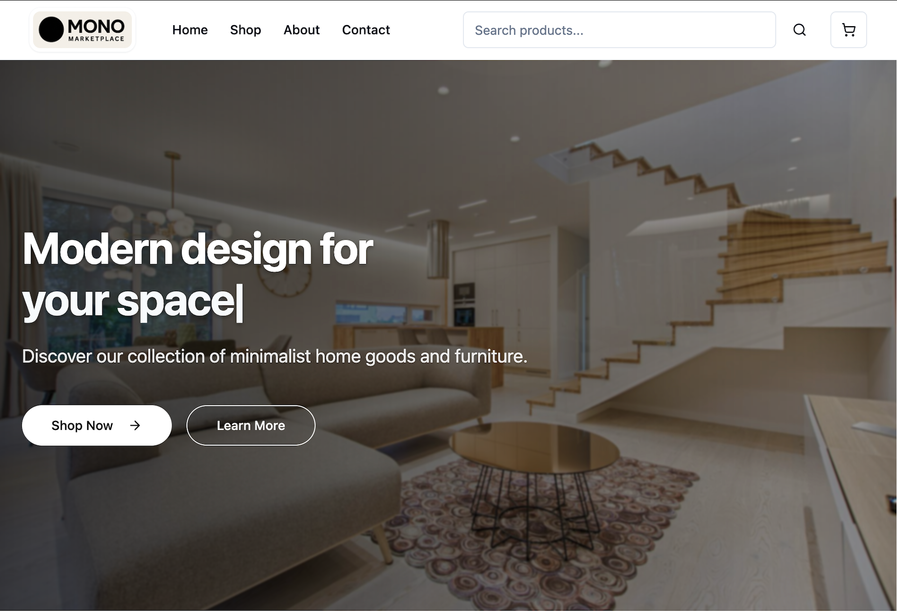

# MONO Marketplace

> A minimalist e-commerce experience where design meets functionality

<div align="center">



[](https://reactjs.org/)
[](https://www.typescriptlang.org/)
[](https://tailwindcss.com/)
[](https://github.com/MISTERKID/mono-marketplace)

[View Demo](https://mono-marketplace.vercel.app) · [Report Bug](https://github.com/MISTERKID/mono-marketplace/issues) · [Request Feature](https://github.com/MISTERKID/mono-marketplace/issues)

</div>

## ✨ Features

### 🛍️ Shopping Experience
- **Grid & List Views**: Browse products your way
- **Smart Filters**: Find exactly what you're looking for
- **Real-time Cart**: Watch your selections update instantly
- **Responsive Design**: Looks great on any device
- **Newsletter**: Stay updated with our latest offerings

### 🎨 Design Highlights
- Clean, minimalist aesthetic
- Smooth animations and transitions
- Intuitive navigation
- Beautiful product showcases
- Category-based browsing

## 🛠️ Tech Stack

| Category | Technologies |
|----------|--------------|
| Frontend | React + TypeScript |
| Styling | Tailwind CSS |
| Routing | React Router |
| State | React Context |
| Icons | Lucide React |
| Images | Pexels API |
| Build | Vite |

## 🚀 Getting Started

### Prerequisites
- Node.js (v14 or higher)
- npm or yarn

### Quick Start

```bash
# Clone the repository
git clone https://github.com/MISTERKID/mono-marketplace.git

# Navigate to project directory
cd mono-marketplace

# Install dependencies
npm install
# or
yarn install

# Start development server
npm run dev
# or
yarn dev
```

Visit `http://localhost:5173` to see your application running.

## 📁 Project Structure

```
mono-marketplace/
├── src/
│   ├── components/     # Reusable UI components
│   ├── pages/         # Page components
│   ├── services/      # API and service functions
│   ├── types/         # TypeScript type definitions
│   ├── utils/         # Utility functions
│   ├── App.tsx        # Main application component
│   └── main.tsx       # Application entry point
├── public/            # Static assets
├── index.html         # HTML template
└── package.json       # Project dependencies
```

## 🤝 Contributing

We welcome contributions! Here's how you can help:

1. Fork the repository
2. Create your feature branch (`git checkout -b feature/AmazingFeature`)
3. Commit your changes (`git commit -m 'Add some AmazingFeature'`)
4. Push to the branch (`git push origin feature/AmazingFeature`)
5. Open a Pull Request

## 📜 License

This project is licensed under the MIT License - see the [LICENSE](LICENSE) file for details.

---

<div align="center">

### Show your support

Give a ⭐️ if you like this project!

Made with ❤️ by Sai Seng Main

</div> 